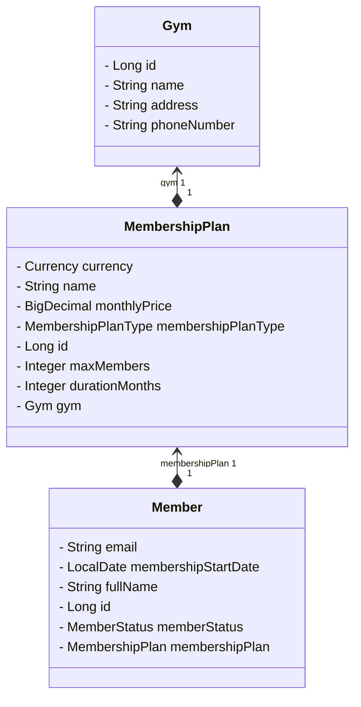

# Gym Membership Management System

A backend RESTful application designed to manage fitness club infrastructure. The system allows for the creation of gyms, assigning various membership plans with built-in capacity limits, and member registration.

---

## Technologies & Architecture

* **Java 21**
* **Spring Boot 4.1.0**
* **Gradle** (Build Tool)
* **H2 Database** (In-memory database)
* **JUnit 5 & Mockito** (Unit and integration tests)
* **Docker & Docker Compose**

---

## How to Run the Project

You have two options to choose from—a one-click start via Docker (recommended) or a manual startup.

### Option A: Running via Docker (Recommended)

You do not need Java or Gradle installed on your computer. Docker is all you need. The application will build automatically.

1. Open a terminal in the project's root directory.

2. Execute the following command:

```bash
docker compose up --build -d
```

3. The application will be available at:

```text
http://localhost:8080
```

### Option B: Manual Startup

If you want to run the application directly from an IDE or console (Java 21 required):

1. Build the application using the Gradle Wrapper:

```bash
./gradlew clean build -x test
```

2. Run the application:

```bash
./gradlew bootRun
```

Alternatively, you can run the generated `.jar` file directly.

---

## Database Access (H2 Console)

The application uses a built-in, in-memory H2 database.

Once the application is running, the H2 console is available using the following details:

| Parameter   | Value                      |
| ----------- | -------------------------- |
| Console URL | `http://localhost:8080/db` |
| JDBC URL    | `jdbc:h2:mem:gym_db`       |
| Username    | `sa`                       |
| Password    | *(leave blank)*            |

---

## API Endpoints & Examples

#### 1. Create a New Gym

**POST** `/api/gyms`

```json
{
  "name": "FitLife Center",
  "address": "ul. Piotrkowska 157a, Łódź",
  "phoneNumber": "123456789"
}
```

#### 2. List All Gyms

**GET** `/api/gyms`

Returns a list of all gyms.

#### 3. Revenue Report *(Optional Task)*

**GET** `/api/gyms/report`

Returns the revenue report.

---

#### 4. Create a new Membership Plan for a given Gym

**POST** `/api/plans/{gymId}`

```json
{
  "name": "Open Premium Pass",
  "membershipPlanType": "PREMIUM",
  "monthlyPrice": 150.99,
  "currency": "USD",
  "durationMonths": 12,
  "maxMembers": 100
}
```

#### 5. List Membership Plans for a Gym

**GET** `/api/plans/{gymId}`

Returns all membership plans assigned to the specified gym.

---

#### 6. Register a New Member

**POST** `/api/members`

This endpoint automatically validates plan capacity and rejects the request when the selected membership plan has reached its `maxMembers` limit.

```json
{
  "fullName": "Jan Kowal",
  "email": "jan.kowal@example.com",
  "membershipPlanId": 1
}
```

#### 7. List All Members

**GET** `/api/members`

Returns a list of all registered members.

#### 8. Cancel a Membership

**POST** `/api/members/{memberId}/cancel`

Cancels the active membership associated with the specified member.

## Database Schema

The following diagram presents the entity relationships within the system:



---

## Continuous Integration & Testing

The project is automated via a **GitHub Actions CI Pipeline**.

* **Services (Unit Tests):**  logic coverage using Mockito (BDD format).
* **Repositories (Integration Tests):** Custom queries are verified using `@DataJpaTest`.
* **Controllers (Manual Testing):** Due to full coverage of the domain logic, REST controllers (HTTP status codes and `@Valid` input validation) were manually tested using **Postman**.

---

## Potential future improvements

The system's architecture allows for straightforward future expansion.

### Global Error Handling

Implementing a class annotated with `@RestControllerAdvice` to:

* Standardize error response formats
* Improve validation message readability
* Simplify exception handling on the client side

### Security

Implementing Spring Security together with JWT authentication to:

* Authorize users
* Protect administrative endpoints
* Control access to resources